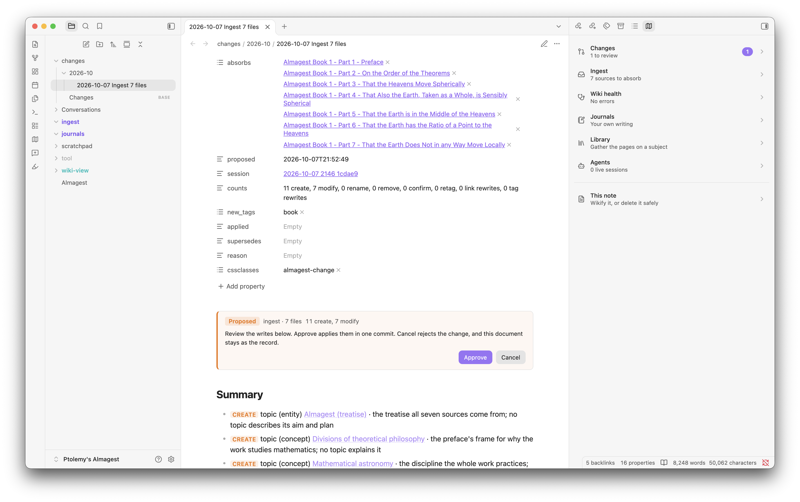
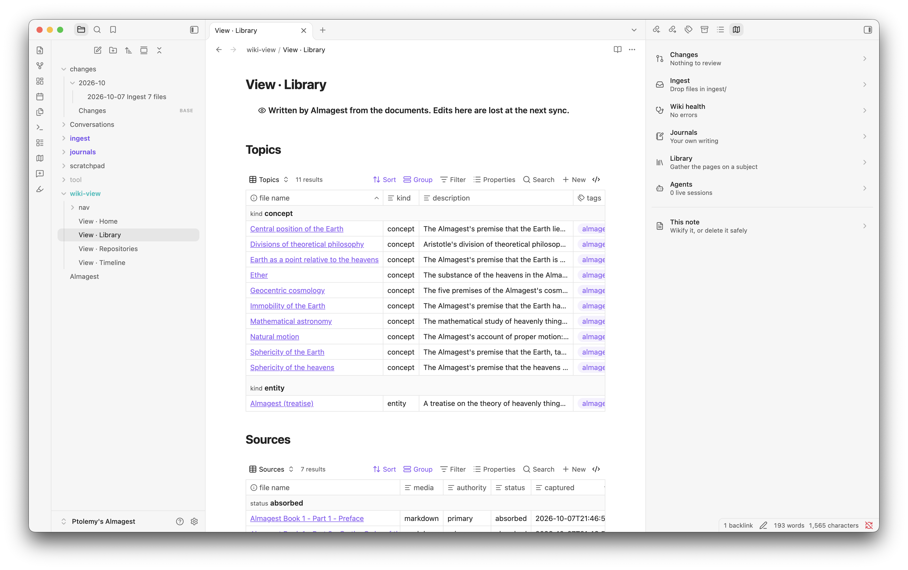
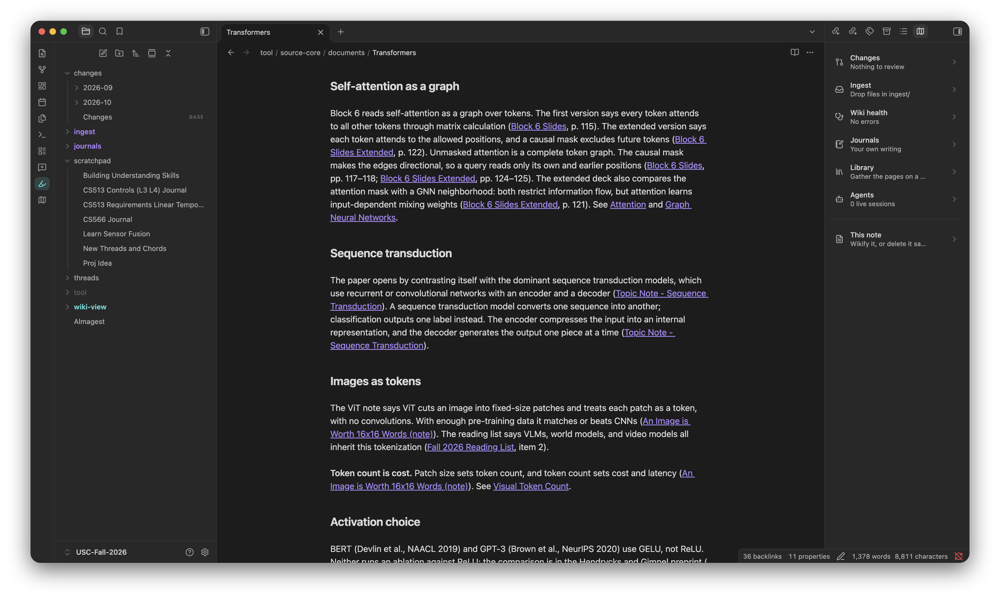
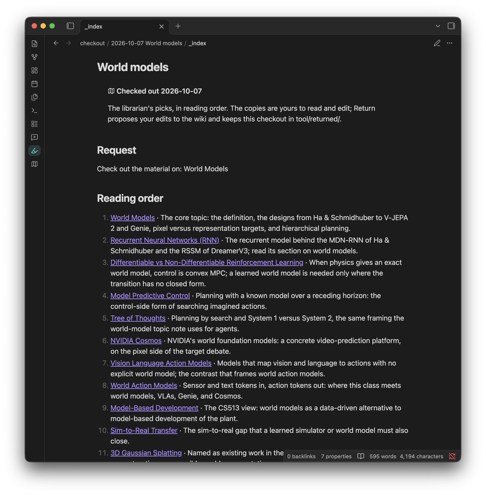
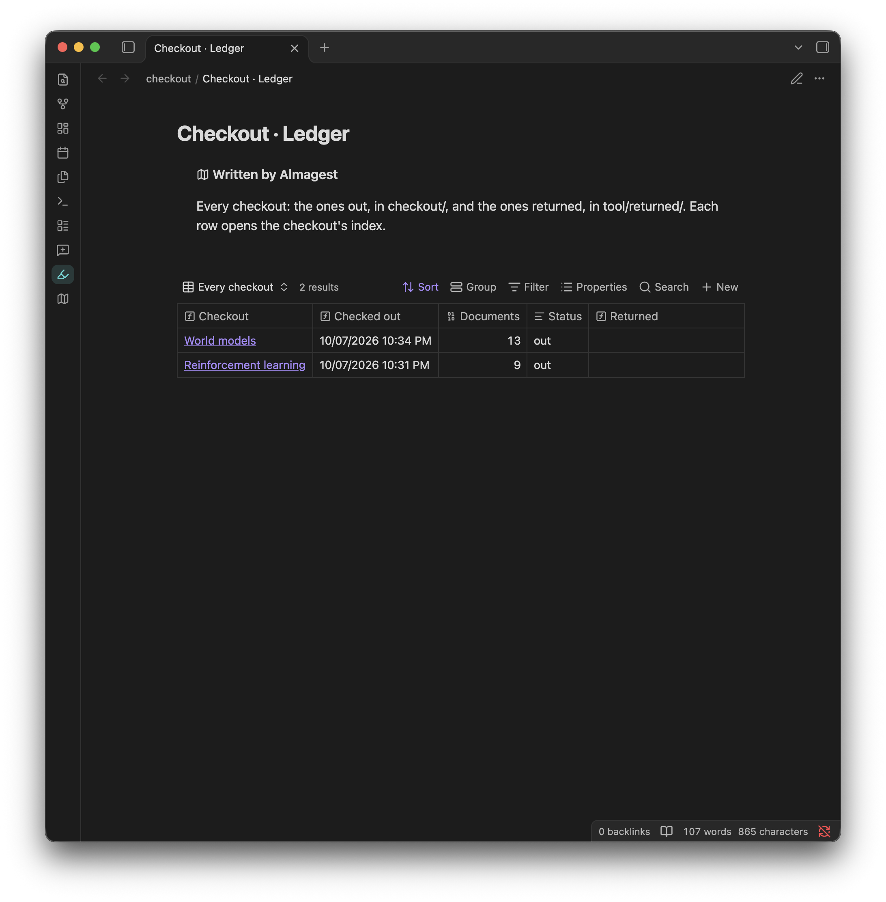
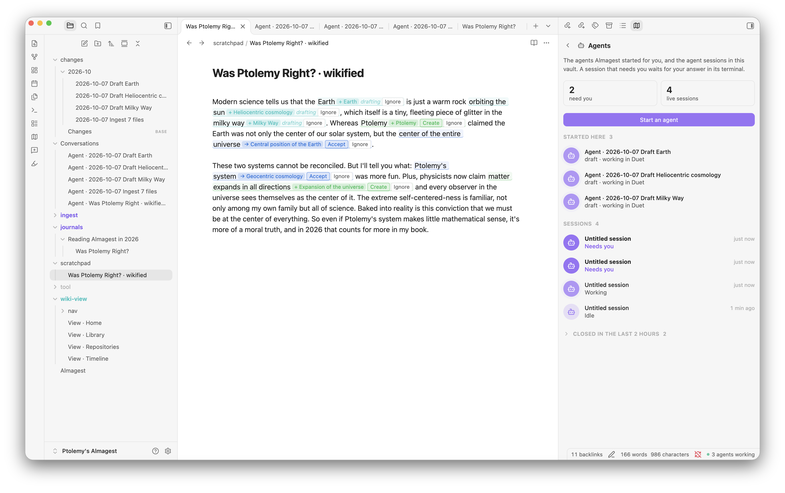

# Almagest for Obsidian

The Obsidian interface of [Almagest](https://github.com/nathanaday/almagest): an LLM wiki designed for humans.

The Almagest agent plugin for Claude Code or Codex does the work; this plugin is the interface for Obsidian.

## Features

### Wiki Ingest

Drop papers, PDFs, or notes into `ingest/`, and press Ingest. Each ingest task becomes one
document that you watch as it works. Change logs can be approved, canceled, edited, and questioned.

<p align="center">
  
</p>


### Approve / Reject Flow for all Agent Changes

Any change to your knowledge base gets a dedicated "changes" page with a clear approve or deny path. You can also edit the change plan, or ask your agents for clarifications. This keeps your knowledge base under your control.

<p align="center">
  
</p>


### Wiki View for humans, Wiki Core for agents

All raw sources, change logs, and llm doc live under the hood in a `tool/` directory. It's self-updating, but you don't have to look at it. This is where the MCP tools do fast information queries and where all new sources are ingested.

The plugin constructs your `wiki-view` from these sources: a home age, timeline, library, and a navigation page for each tag. The user-interface can evolve over time with improvements with no impact to the core structure.

<p align="center">
  
  
</p>


### Repository Links

Link your code repositories, and the agent writes a page for each. An agent started in
the vault finds the repository you mean and works in it, and its session leaves a
record of what it did.

### Journals

A `journals/` area holds your own writing, organized by volumes. You are the contributor! Crucially, your journal does not move when its ingested. It stays there in `journals/`, even though its been integrated into your knowledge base.

When you want the wiki to learn from a volume, use the Publish action. Almagest captures the whole journal as one edition, then the agent ingests it as it would any source. Every edition stays in the vault, and each volume keeps a publication history. 

### Librarian

Ask to "check out all the material on reinforcement learning" or whatever topic you have in your vault. The librarian finds all relevant pages, follows their links only as far as they stay relevant, and puts copies of them in `checkout/` with a reading list. Read and mark up the copies. The (optional) `Return` action proposes your edits to the originals as one change, and a ledger lists every checkout.

<p align="center">
  
  
</p>

### Wikify a note (experimental)

Take any draft you are working on. The agent marks what the wiki already knows, then marks the subjects that are new and worth a page. You can Accept or Ignore new links directly on the UI. The wikified note stays where you are working on it, and does not need to enter the knowledge base until you are ready to ingest it.

<p align="center">
  
</p>

### Safe delete

Not sure whether you can delete a page? Don't want to break anything? Safe delete moves it to `tool/trash/` when nothing links it. When something does, it shows the links, and an agent can repoint them for you. Empty `tool/trash/` yourself when you like.

### Agent Conversations

Supports agent sessions in a terminal of your choice or directly in Obsidian using the Duet plugin.

<p align="center">
  
</p>


## Requirements

- Obsidian 1.13 or later, on the desktop. The agent actions know the macOS terminals
  (Terminal, iTerm2, WezTerm, Ghostty); elsewhere, set a custom terminal command.
- The Almagest agent plugin and its `almagest` binary. Install the agent plugin in
  Claude Code:

  ```bash
  claude plugin marketplace add nathanaday/almagest
  claude plugin install almagest@nathanaday-almagest
  ```

  Its first session installs the binary at `~/.almagest/bin/almagest`. For Codex and
  the details, see the
  [Almagest guide](https://github.com/nathanaday/almagest/blob/main/docs/guide.md#install-and-update).
- A vault that Almagest made (`almagest vault init`, or the `almagest-onboard` skill).

This plugin never downloads, installs, or updates the binary, and never installs or
updates itself: Obsidian's community plugins do that.

## Disclosures

- **A program outside the vault.** The plugin runs the `almagest` binary for every read
  and write: the status it shows, Approve and Cancel, Safe delete, Publish, Return,
  Wikify, and the quiet snapshots. It runs `~/.almagest/bin/almagest`, or the path in its
  settings. It never searches `PATH`. The binary reads and writes the vault and its git
  history, and reads `~/.almagest/config.json`.
- **Files outside the vault.** Through the binary, the plugin reads `~/.almagest/` and the
  repositories that your repository documents link, for their branch and status.
- **Other programs.** Start agent, Ingest, and the other agent actions open your agent
  (Claude Code or Codex) in your terminal, with the command and the terminal in your
  Almagest settings, or in the Duet plugin when Duet is on.
- **Clipboard.** Off macOS, or when no terminal opens, the plugin copies the agent's
  command to the clipboard for you to paste. It never reads the clipboard.
- **Vault files.** The plugin reads the folders Almagest keeps (`tool/source-core/documents/`,
  `tool/sessions/`, and `changes/`) to show the documents, sessions, and changes. It lists
  no other folder.
- **Network.** The plugin makes no network request. The agents you start use their own.
- **Telemetry, accounts, payment.** None.

## License

MIT. See [LICENSE](LICENSE).
